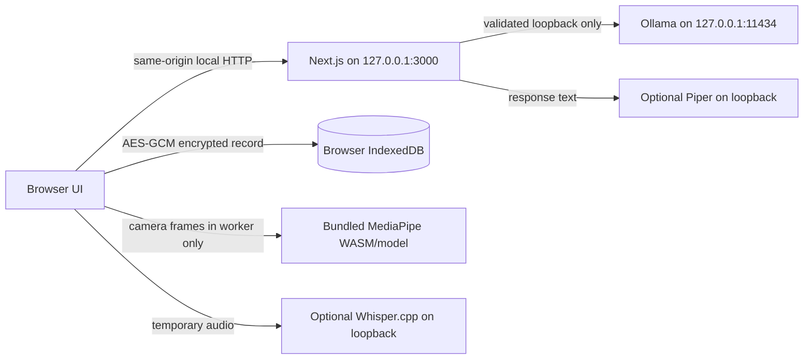

# MindSpace AI

A local-first companion that routes chat only to a loopback Ollama service. No cloud model, analytics SDK, account system, or remote data store is configured.

## Run locally

```sh
npm install
npm run dev
```

Open http://localhost:3000. Use `npm run typecheck`, `npm run lint`, and `npm run build` for checks.

## Foundation layout

- `src/app/api/chat`: validated same-origin streaming relay to Ollama's local `/api/chat` endpoint.
- `src/app/api/ollama/models`: lists installed local chat models through `/api/tags`; there are no model-management routes.
- `src/lib/ai`: loopback validation, request schemas, companion prompt, and model-independent safety routing.
- `src/components/local-chat.tsx`: conversation controls, model/style settings, explicit memories, and local export.
- `src/lib/storage/encrypted-vault.ts`: encrypted IndexedDB vault.

## Local data and privacy boundary

Conversation history and user-authored memories are encrypted in the browser's IndexedDB with AES-256-GCM. A passphrase is converted to an encryption key using PBKDF2 (310,000 SHA-256 iterations). The passphrase and key are not persisted; the key is held only in the current tab's memory. Reloading requires unlocking the vault again. A forgotten passphrase cannot be reset. Export creates a plaintext JSON file only after the user explicitly chooses Export.

The server does not store conversations. For each chat request, the browser sends the active conversation context, selected style, and enabled memories to this app's loopback-only API relay. The relay forwards them to the user's loopback Ollama endpoint. Do not expose the Next.js server or Ollama port to a network. This is at-rest protection against copied browser storage, not protection from malware, a compromised browser/extension, a person using an unlocked tab, weak passphrases, or unencrypted exports/backups. IndexedDB is not inherently encrypted; the application encrypts its vault records before writing them.

The app only checks installed models and streams chat. It never invokes Ollama model download/delete operations and never falls back to cloud inference. By default, only port `11434` is accepted. For an intentionally custom local Ollama port, configure a private server environment variable such as `OLLAMA_ALLOWED_PORTS=11434,11435`; the browser setting must still use a loopback IP and an allowed port. Ensure the Ollama model itself is local and use Ollama's own controls for its service exposure.

## Local voice mode (push to talk)

Voice mode uses a batch local pipeline: microphone recording in the browser → Whisper.cpp local HTTP server → the same loopback Ollama chat API → Piper local HTTP server → browser audio playback. No Web Speech API, cloud speech services, or analytics are used. Audio is held in memory until sent to the configured Whisper.cpp loopback service and is not written to IndexedDB or server files. The editable transcript and voice turns currently remain in the active tab only; use the encrypted Chat workspace for saved conversations. Text chat remains usable when speech services are missing.

Install speech software and acquire speech models/voices yourself; MindSpace does not download them. For this PC (Ryzen 7 7435HS, 16 GB RAM, RTX 4050 4 GB), Whisper.cpp `base` is a reasonable starting point; its project lists about 388 MB RAM for base and supports CPU/GPU builds. Start its server bound only to loopback with an explicitly installed ggml model, for example:

```powershell
whisper-server --host 127.0.0.1 --port 8080 --convert -m C:\models\ggml-base.bin
```

Whisper.cpp `--convert` requires `ffmpeg` so browser WebM/MP4 recordings can be decoded.

Install maintained Piper and its HTTP extra in a Python environment, then obtain a voice explicitly. Review that voice’s model card because voice licenses vary. Start Piper bound to loopback:

```powershell
python -m pip install "piper-tts[http]"
python -m piper.download_voices --data-dir C:\models\piper en_US-lessac-medium
python -m piper.http_server -m en_US-lessac-medium --data-dir C:\models\piper --host 127.0.0.1 --port 5000
```

The Piper command above only downloads when you run it manually. MindSpace checks Whisper.cpp at its root address and Piper’s `/voices`, sends recordings only to Whisper.cpp `/inference`, and sends response text only to Piper `/synthesize`. It accepts loopback IPs only and by default allows Whisper port `8080` and Piper port `5000`; if you intentionally choose other ports, set private server variables `WHISPER_ALLOWED_PORTS` and/or `PIPER_ALLOWED_PORTS` to comma-separated ports before starting Next.js. Do not expose the Next.js, Whisper.cpp, Piper, or Ollama services to your network.

In **Voice space → Configure**, check services, choose an installed Piper voice and Ollama model, then press the microphone button to record. Silence for about 1.8 seconds after speech ends a turn; recordings are capped at 30 seconds. Review or edit the transcript before sending. Synthesis is batch-based; the reply text appears while Piper generates the WAV. Stop interrupts playback or the active model request. Browser microphone access requires localhost or HTTPS. Offline operation works after all required software, local assets, and Ollama models are installed; service/API builds alone cannot verify speaker hardware or acoustic quality. Piper is GPL-3.0 software, and each voice has its own license terms.

Official setup references: [whisper.cpp](https://github.com/ggml-org/whisper.cpp) and its [HTTP server API](https://github.com/ggml-org/whisper.cpp/blob/master/examples/server/README.md); [maintained Piper](https://github.com/OHF-Voice/piper1-gpl), [HTTP API](https://github.com/OHF-Voice/piper1-gpl/blob/main/docs/API_HTTP.md), and [voice licensing guidance](https://github.com/OHF-Voice/piper1-gpl/blob/main/docs/VOICES.md).

## Optional local face landmarks

Open **Face analysis** to try an optional MediaPipe Face Landmarker visualization. The camera is off by default and is requested only after the user confirms the explanation and enables the camera. The feature locates facial landmarks; it does not identify people or infer feelings, intent, personality, or health. The preview, mesh, and smoothed movement descriptions are independent controls. Camera tracks and the worker stop when the user turns the camera off, leaves the page, or closes the session. Face frames and landmarks are transient and never written to browser storage.

`@mediapipe/tasks-vision` 1.1.0 is installed from npm. The runtime WASM assets from that package and the official float16 Face Landmarker bundle are stored under `public/mediapipe/wasm/` and `public/mediapipe/models/face_landmarker.task`. The model was acquired from Google's [official Face Landmarker model bundle](https://storage.googleapis.com/mediapipe-models/face_landmarker/face_landmarker/float16/latest/face_landmarker.task), currently 3,758,596 bytes. Runtime uses the package's `FilesetResolver.forVisionTasks("/mediapipe/wasm")`, `FaceLandmarker.createFromOptions`, `runningMode: "VIDEO"`, and `detectForVideo`; no CDN or third-party runtime fetch is used. The worker owns detection because video inference is synchronous; only temporary normalized coordinates are returned to draw the mesh, and only coarse movement labels are kept in page state.

Expression indicators are off by default and use documented blendshape coefficients only to label observable smile-related or brow movements. Smoothed scores are never saved. The separate **Share expression summary with my AI companion** consent is off by default; even when enabled, the user must press **Send optional summary to local AI**. That sends only a short text summary through the existing loopback Ollama chat relay, not camera frames, images, or landmarks. The response is shown transiently in Face analysis and is not saved to chat history, memory, journal, export, or analytics. The user should confirm or reject any suggestion in their own words.

The local assets are included in this repository so they are available after installation without internet access. Camera use requires browser permission and localhost or HTTPS. For the model and runtime details, see the [official Face Landmarker Web guide](https://developers.google.com/edge/mediapipe/solutions/vision/face_landmarker/web_js) and [model overview](https://developers.google.com/edge/mediapipe/solutions/vision/face_landmarker).

## Checks

```sh
npm run typecheck
npm run lint
npm test
npm run build
```

To test the full API workflow with a running local Ollama instance and the installed `llama3.2:latest` model, start `npm run dev` in one terminal and run `npm run test:chat` in another. The test sends only a short synthetic greeting prompt to the local model.

## Phase 5: reflection tools and offline readiness

The `/personality`, `/mood`, `/journal`, `/wellness`, `/settings`, and `/offline` pages now use local features rather than demo placeholders. The 60-item `mindspace-preferences-60-v1` assessment uses original prompts and deterministic scoring; it is an illustrative self-reflection tool, not a validated psychological instrument or diagnosis. Mood trends summarize only saved user entries. Wellness activities are optional, stoppable exercises and are not treatment.

Journal and mood notes are never read automatically by chat. A user must enable the matching sharing setting and then explicitly press the one-time reflection action on a selected item. Only that selected text/record is sent to this app's loopback Ollama relay. The result is transient, not saved into history. Expression summaries remain separately opt-in. Conversation memory is separately enabled and user-authored. Every setting can be turned off again.

All conversations, memories, assessment answers/results, journal entries, and mood check-ins are serialized into one record in the browser profile's IndexedDB database `mindspace-private-vault` and encrypted in the browser with AES-256-GCM using the passphrase-derived key described above. Personal data is held in the tab's memory after unlock and written encrypted. Clearing the vault removes that database and local AI/voice/face preferences. Export/import is an explicit plaintext JSON backup: anyone with access to that export can read it. Browser encryption does not protect data from a compromised device, browser, extension, or unlocked tab.

### Offline setup on Windows

Use Node.js 24.x and npm 12.x (the versions used during this phase). In PowerShell, from the repository folder:

```powershell
npm ci
npm run dev
```

The app binds to `127.0.0.1:3000`. To use chat offline, install Ollama and explicitly acquire a model while online; MindSpace does not download it:

```powershell
ollama pull llama3.2:latest
ollama list
```

The installed `llama3.2:latest` model was present during this implementation. The larger `gemma4:26b` was also present, but it is not a suggested starting model for the listed 16 GB RAM / RTX 4050 4 GB machine. Keep the Ollama service bound to loopback.

The optional private server variables are `OLLAMA_ALLOWED_PORTS` (default `11434`), `WHISPER_ALLOWED_PORTS` (default `8080`), and `PIPER_ALLOWED_PORTS` (default `5000`). They are comma-separated port allow-lists for services bound to `127.0.0.1`; they do not select models or download anything. No AI provider secret or cloud credential is used.

The `dev`, `build`, and `start` npm scripts set `NEXT_TELEMETRY_DISABLED=1` through `cross-env`; the app does not opt into Next.js CLI telemetry.

Voice prerequisites are separate from Ollama. This machine did not have `whisper-server`, `whisper-cli`, `piper`, or `ffmpeg` installed at implementation time, so voice readiness reports unavailable until the user installs them. Follow the voice section above to install Whisper.cpp and Piper and explicitly obtain local speech assets. The illustrative Whisper `base` model uses about 388 MB RAM in the project documentation; actual speed and quality vary. Piper voice files have individual licenses; review each voice model card before use. The app will not fetch any speech model or voice. Text chat remains usable when either speech service is missing.

MediaPipe is self-contained in this repository after npm installation: runtime files are in `public/mediapipe/wasm/`, with the Face Landmarker task file in `public/mediapipe/models/`. The npm package, WASM, and model are local; camera access still requires browser permission and localhost/HTTPS.

Open `/offline` to check the local app assets, MediaPipe model/WASM, IndexedDB availability, Ollama model/service, Whisper.cpp, and Piper independently. “Browser network state” uses `navigator.onLine`; it is not a packet capture or proof that the whole machine has no network traffic. The app currently has no service worker, so the local Next.js server must be running even when the computer has no internet connection. `npm ci` and initial model/runtime acquisition require internet access. Windows microphone/camera device drivers and OS permissions remain local operating-system prerequisites.

### Data flow and boundary



The intended runtime requests are same-origin app/API requests plus server-side requests to explicitly allowed loopback Ollama/Whisper/Piper endpoints. MediaPipe fetches same-origin model/WASM files. User-clickable official setup/documentation links are present in the UI and README; they navigate externally only when selected and are not asset or API dependencies. The codebase contains no analytics or telemetry SDK, external AI provider, external font, remote image, or CDN runtime import. Vendored MediaPipe WASM contains upstream references in comments/licenses, not runtime endpoints. API route requests are origin checked, bounded, rate limited, and do not log prompts or recordings. The browser diagnostic performs same-origin checks; this is not equivalent to a Windows firewall capture. For a strict network audit, capture traffic with Windows Firewall/WFP or Wireshark while exercising the app; that capture was not available during this phase. No zero-network-traffic claim is made.

`npm audit --omit=dev` reported no production dependency advisories. `npm audit` still reports nine advisories in the existing Tailwind 3 / ESLint development dependency tree; npm's suggested automatic remediation upgrades to Tailwind 4, which would be a breaking stack change, so it was not applied in this phase.

To reproduce the checks:

```powershell
npm run typecheck
npm run lint
npm test
npm run build
```

For the additional real local-model smoke test, run `npm run dev` in one PowerShell window and `npm run test:chat` in another. End-to-end device testing of microphone capture, audible playback, camera permission, and truly disconnected network operation requires the optional speech programs/models and physical/browser devices; the available automated tests mock those hardware boundaries.
